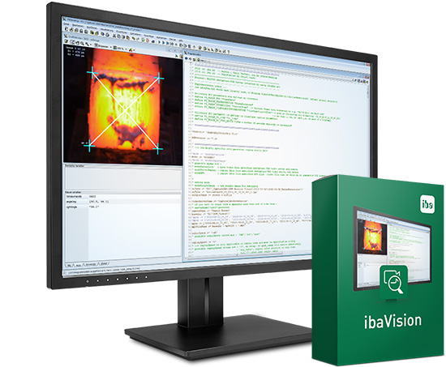

# ibaVision v3 .NET plugin example

ibaVision v3 introduced the concept of custom .NET plugins, which allow the user to extend ibaVision functionalities and its UI. A plugin can execute arbitrary code on inputs or provide outputs from external sources like a camera. Example use-cases could the use of openCV (using a common .NET wrapper like 'opencvsharp') to perform image processing on an input signal or the import of video data from cameras, that are currently not supported by any of the common interfaces in ibaCapture (but have a .NET API available). 

This example project is intended as a template and tutorial for plugin development. It reads BMP images from a user provided directory and generates a looping video output from these image that can be displayed in ibaCapture or ibaPDA as an ibaVision input.

## Requirements
- Microsoft Visual Studio 2017 or newer
- .NET 4.8 developer pack (can be installed automatically through Visual Studio)
- [ibaVision](https://www.iba-ag.com/en/ibavision) version >= 3.0.0
- a valid ibaVision license

## Disclaimer

This code is provided “as is” and serves as an example for the development of ibaVision .NET plugins. iba AG does not provide general support for programming languages, third party libraries/products or for user created plugin functionalities. All terms of ibaVision's license agreement apply.

## Quick Start

**Build and use the example plugin**

1. Install ibaVision v3 or higher on the system
2. Open 'ImageImporterPlugin.sln' using Visual Studio 2017 or newer
3. Check the references of the ImageImporterPlugin project for the 'ibaVisionPluginLib' assembly. If the reference is broken, remove it and add it again with the correct path. The assembly can be found in the ibaVision install directory.
4. Create a new directory with the name 'ImageImporter' in the 'Plugins' directory of your ibaVision install. Build the solution and copy the generated 'ImageImporterPlugin.dll' to this 'ImageImporter' folder.
5. Start ibaVision, add a new program and select the plugin type 'Image importer' in the Plugin settings of the program. Provide the path to a directory with BMP images and configure the rest of the program as usual. The images are provided as an iconic output in the 'Load images' procedure.

## Where can I find more information?

The ibaVision manual contains detailed explanation on how to use and configure ibaVision programs. The full documentation for .NET plugin development can be found in the documentation subfolder of this repository.

The example project also contains various comments and class summaries that can help to get familiar with plugin development.